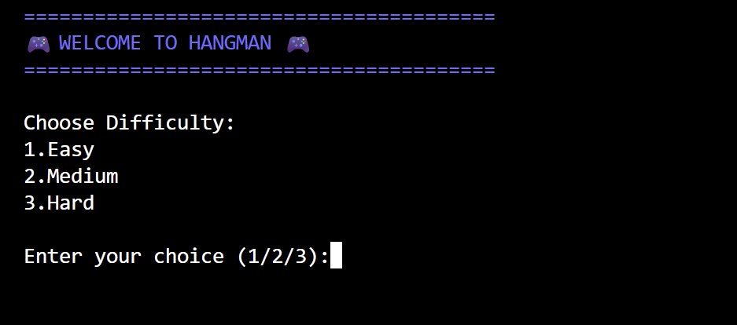

# 🎮 Hangman Game — CodeAlpha Internship Project

A fun and interactive terminal-based Hangman Game developed using Python as part of the CodeAlpha Python Programming Internship.

---

## 📌 Project Description

This project is a text-based Hangman game where players try to guess a hidden word one letter at a time before running out of attempts.

The game includes multiple difficulty levels, ASCII hangman graphics, replay functionality, and input validation to provide a better user experience.

---

## ✨ Features

- 🎯 Multiple Difficulty Levels
  - Easy
  - Medium
  - Hard

- 🎨 ASCII Hangman Art

- 🔁 Replay Option

- ✅ Input Validation

- 🎲 Random Word Selection

- 🧠 Clean Function-Based Code Structure

- 💻 Console-Based User Interface

---

## 🛠️ Technologies Used

- Python 3

### Python Concepts Used
- Functions
- Loops
- Conditional Statements
- Lists
- Strings
- Random Module
- User Input Handling

---

## 📂 Project Structure

```bash
CodeAlpha_HangmanGame/
│
├── main.py
└── README.md
```

---

## ▶️ How to Run the Project

### 1. Clone the Repository

```bash
git clone https://github.com/PDCS-Codes/CodeAlpha_HangmanGame.git
```

### 2. Navigate to the Project Folder

```bash
cd CodeAlpha_HangmanGame
```

### 3. Run the Game

```bash
python main.py
```

or

```bash
py main.py
```

---

## 🎮 Game Rules

- Guess the hidden word one letter at a time.
- Each incorrect guess adds a part to the hangman.
- The player loses if the hangman is fully completed.
- Win by guessing the word before running out of attempts.

---

## 📸 Screenshots

### 🎮 Title Screen


---

### 🎯 Gameplay


---

### 🎉 Winning Screen


---

### 💀 Game Over Screen


---

## 🚀 Future Improvements

- Colored Terminal UI
- Timer Mode
- Hint System
- Score Tracking
- GUI Version using Tkinter
- Online Multiplayer Version

---

## 👩‍💻 Author

Developed by **PDCS-Codes**

As part of the **CodeAlpha Python Programming Internship**.

---

## 📜 License

This project is for educational and internship purposes.